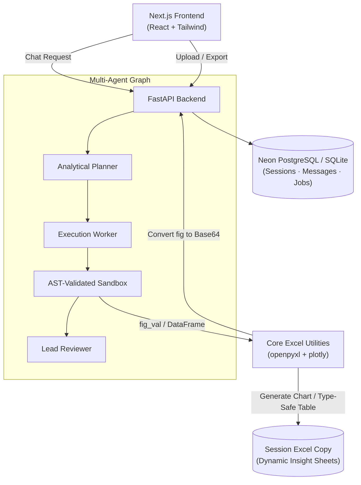
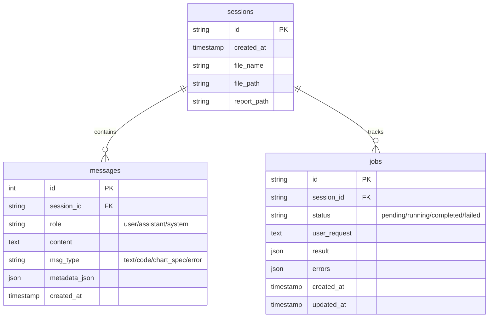

<div align="center">

# Exodus

### *AI-Powered Data Intelligence & Continuous Excel Reporting Platform*

**Talk to your spreadsheets. Build native reports dynamically.**

Exodus is an advanced data intelligence platform that reads, processes, and visualizes complex datasets. It couples a LangGraph-based multi-agent backend with a strict AST-validated execution sandbox, giving you conversational chat insights, beautiful frontend graphs, and live-updated, downloadable Excel spreadsheets complete with native, editable Excel charts.

<br/>

[](https://fastapi.tiangolo.com)
[](https://nextjs.org)
[](https://tailwindcss.com)
[]()
[](https://postgresql.org)
[](https://neon.tech)
[]()

<br/>

**[Technical Docs](backend/README.md)** · **[Quick Start](#quick-start)** · **[Issues](../../issues)**

</div>

---

## What Exodus Does

Upload your workbook, start asking questions, and let Exodus do the plotting, calculations, and reporting for you.

```
Input:  Financial Sample.xlsx                       (or CSV / XLS)
        ↓
Chat:   "make a bar graph for monthwise gross sales in Canada"
        ↓
Output: Interactive base64 chart shown in Chat + Active Insights Gallery
        ↓
Report: Dynamically appends a new sheet 'Insight_1' to the workbook containing:
        - The sorted, formatted month-wise Canada gross sales data table.
        - An editable, colorful native Excel BarChart referencing the table.
```

**Your charts in Excel remain native and interactive—you can click, recolor, resize, and edit the source data directly inside Excel.**

---

## Features

| Feature | Description |
|---------|-------------|
| **Metadata Profiling** | Automatically computes statistics, shapes, types, and missing values on upload. |
| **LangGraph Orchestrator** | Multi-agent state machine (Planner -> Worker -> Reviewer) for robust processing. |
| **AST-Validated Sandbox** | Parses and validates generated code to prevent execution of unauthorized system commands. |
| **Native Excel Charts** | Translates Plotly express figures into native BarChart, LineChart, and ScatterChart objects. |
| **Dynamic Bar Coloring** | Auto-enables varyColors = True for distinct category colors in Excel reports. |
| **Chronological Sorting** | Automatically formats month name columns (pd.Categorical) chronologically in queries. |
| **Continuous Excel Updates** | Appends each chat analysis into sequential Insight_X worksheets in a live session copy. |
| **Active Insights Gallery** | Accumulates and displays base64 Plotly previews in a scrollable sidebar gallery. |
| **Export Results** | Dynamically downloads the latest state of the spreadsheet containing all progressive worksheets. |

---

## Architecture



---

## Project Structure

```
EXODUS/
├── backend/
│   ├── api/
│   │   └── routes.py           # FastAPI routes (Upload, Analyze, Chat, Export)
│   ├── agents/
│   │   ├── base.py             # Agent Base Class
│   │   ├── prompts.py          # System Prompts (Planner, Worker, Reviewer, FollowUp)
│   │   ├── state.py            # Graph and Workflow State Models
│   │   ├── graph.py            # LangGraph Workflow Definition
│   │   ├── data_explorer.py    # Exploratory Data Agent
│   │   └── follow_up.py        # Conversational Analyst Agent
│   ├── core/
│   │   ├── sandbox.py          # AST-Validated Python Code execution
│   │   └── utils.py            # Native Openpyxl chart converter & DataFrame profiling
│   ├── db/
│   │   ├── database.py         # SQLAlchemy Engine & session init
│   │   ├── models.py           # Session, Message, Settings, Job schemas
│   │   └── crud.py             # DB reads and writes
│   ├── config/
│   │   └── settings.py         # App environment config
│   ├── exports/                # Dynamically updated session xlsx files (Git ignored)
│   ├── uploads/                # Original uploaded data files (Git ignored)
│   ├── main.py                 # FastAPI Application Server Entrypoint
│   └── requirements.txt        # Python libraries (LangGraph, FastAPI, Openpyxl, Plotly)
├── frontend/
│   ├── src/
│   │   ├── app/                # Next.js Pages (Upload Dashboard, Analysis Chat)
│   │   ├── components/         # Chat layout, Sidebar, Active Insights, Data Tables
│   │   └── styles/             # Global CSS & Tailwind design tokens
│   └── package.json
├── localexclude                # Indexing ignore files
├── .gitignore                  # Git tracking exclusions (data, uploads, exports, .env)
└── README.md                   # ← This file
```

---

## Quick Start

### 1. Clone and Configure
```bash
# Clone the repository
git clone https://github.com/yourusername/exodus.git
cd exodus
```

### 2. Set Up the Backend
```bash
# Set up Python virtual environment
cd backend
python -m venv .venv
source .venv/bin/activate  # On Windows: .venv\Scripts\activate

# Install dependencies
pip install -r requirements.txt

# Configure Environment
cp .env.example .env  # Add your API Keys (e.g. GROQ_API_KEY, OpenAI, etc.)

# Start FastAPI Server
python -m uvicorn backend.main:app --host 127.0.0.1 --port 8000
```

### 3. Set Up the Frontend
```bash
# Open a new terminal and run:
cd frontend
npm install
npm run dev
```

---

## API Reference

| Method | Endpoint | Description |
|--------|----------|-------------|
| `POST` | `/api/upload` | Upload initial dataset (CSV/XLSX), copy to exports, profile metadata |
| `POST` | `/api/analyze/async` | Launch a background LangGraph job (returns `job_id`) |
| `GET`  | `/api/analyze/status/{id}` | Query the progress of a background analysis job |
| `POST` | `/api/analyze/cancel/{id}` | Terminate an active workflow job mid-flight |
| `POST` | `/api/chat/{session_id}` | Talk to the data, run sandbox pandas/plotly code, append sheet insights |
| `GET`  | `/api/sessions/{session_id}/messages` | Fetch chat historical messages and code output metadata |
| `GET`  | `/api/export/{session_id}` | Download the live, dynamically updated Excel workbook copy |

---

## Database Schema



---

<div align="center">

```
Built with FastAPI · Next.js · LangGraph · Plotly · openpyxl · Tailwind CSS
```

*Data insights shouldn't stay trapped in chat. Exodus brings them back to life in Excel.*

</div>
